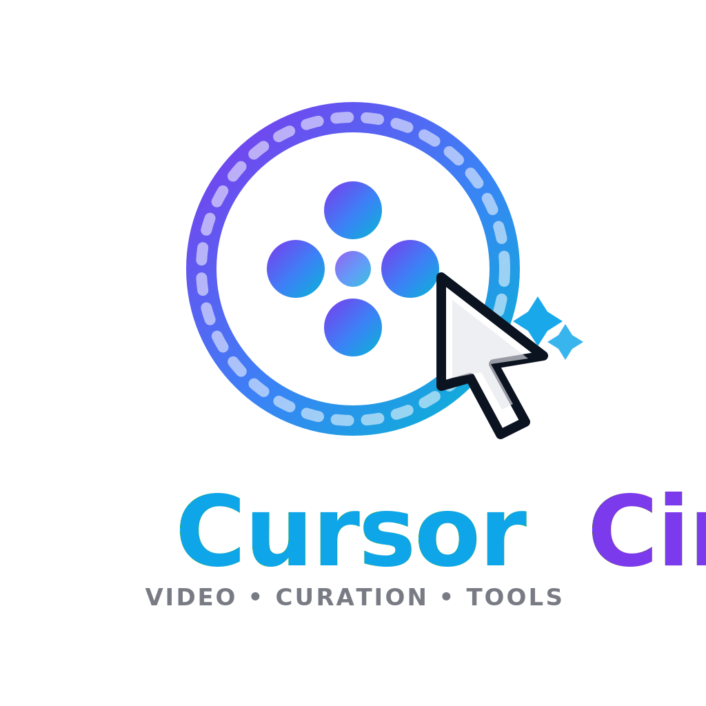

<p align="center">
  
</p>

# CursorCine (Electron)

可在 Windows / Linux 執行的桌面錄影工具，特色是錄影畫面會跟隨游標自動縮放，並內建錄後剪輯時間軸，方便快速產出教學影片。

## Demo

[cursorcine-2026-02-09T08-28-13-836Z.webm](https://github.com/user-attachments/assets/02377999-0465-4cc0-adaf-bcf4a4d1b66f)

## 功能

- 錄製整個螢幕（可選多螢幕來源）
- 鏡頭自動跟隨游標移動，支援可調整的最大縮放倍率與平滑係數
- 單擊時暫時放大、雙擊時鎖定放大（可顯示雙擊標記）
- 輸出格式可選 `WebM` 或 `MP4`（`MP4` 會視環境自動 fallback）
- 可切換畫質檔位（流暢 / 平衡 / 高畫質），在畫質與流暢度間取捨
- 提供 HDR 補償（實驗）：強度、色相、高亮壓縮、清晰度
- 支援系統聲音 + 麥克風混音（含增益與動態壓縮）
- 錄影時可用畫筆即時標註（顏色、粗細、復原一筆、清空）
- 畫筆模式支援 Ctrl 切換與滾輪暫停後自動恢復（需全域 hook 可用）
- 停止錄影後自動進入剪輯時間軸，可回放區段、調整起訖點、儲存定稿
- 剪輯輸出引擎可選：`auto`（ffmpeg 優先）、`ffmpeg`、`builtin`
- 內建輸出 Debug 面板，顯示路徑、錯誤碼與 trace

## 錄製與輸出流程

1. 選擇錄製來源、格式、剪輯輸出引擎、畫質與音訊選項。
2. 按「開始錄影」，程式會建立即時預覽、游標跟隨縮放與畫筆疊層。
3. 按「停止錄製」後，進入剪輯時間軸（播放位置、起點、終點）。
4. 按「儲存定稿」輸出剪輯片段：
   - `auto`: 先嘗試 `ffmpeg`，失敗自動改內建輸出
   - `ffmpeg`: 僅使用 `ffmpeg`
   - `builtin`: 僅使用內建輸出

## 開發執行

```bash
npm install
npm start
```

## Dev Container 開發

本專案已提供 `.devcontainer/`，可在 VS Code / Cursor 的容器環境中直接執行 Electron（含音訊與螢幕相關依賴）。

使用方式：

1. 安裝 Docker。
2. 用 VS Code / Cursor 開啟專案後，執行「Reopen in Container」。
3. 首次建立容器會自動執行 `npm install`（由 `postCreateCommand` 設定）。
4. 在容器終端執行 `npm start` 啟動開發。

目前 devcontainer 內容重點：

- 以 `mcr.microsoft.com/devcontainers/javascript-node:1-20-bookworm` 為基底
- 預裝 Electron 常用系統套件與 `ffmpeg`
- 掛載音訊與顯示相關 socket（X11 / Wayland / PulseAudio）
- 設定 `ELECTRON_DISABLE_SANDBOX=1` 以降低容器中執行限制

若你修改了 `.devcontainer/Dockerfile` 或 `.devcontainer/devcontainer.json`，請執行「Rebuild Container」讓變更生效。

## 打包成執行檔

先安裝依賴：

```bash
npm install
```

通用打包（依當前系統產物）：

```bash
npm run dist
```

只打包 Windows 安裝檔（NSIS）：

```bash
npm run dist:win
```

只打包 Linux 安裝檔（AppImage + deb）：

```bash
npm run dist:linux
```

產物會輸出到 `dist/` 目錄。

## 專案結構

- `src/main.js`: Electron 主程序，提供游標/點擊 IPC、overlay 視窗控制、儲存與 ffmpeg 輸出
- `src/preload.js`: 安全橋接 API
- `src/renderer.js`: 錄影主流程、自動縮放、音訊混音、剪輯時間軸與輸出策略
- `src/overlay.js` / `src/overlay.html`: 畫筆與指示器的全螢幕 overlay
- `src/index.html` / `src/styles.css`: 控制介面與預覽畫面

## 注意事項

- 首次啟動請允許螢幕錄製與麥克風權限。
- `uiohook-napi` 若無法載入，仍可錄影，但全域點擊偵測與 Ctrl 切換能力會受限。
- 輸出使用瀏覽器 `MediaRecorder`，實際可用編碼會因系統不同而異。
- 若要使用 `ffmpeg` 剪輯或 `MP4` 轉檔，系統需安裝 `ffmpeg` 並可在命令列執行 `ffmpeg -version`。
- `auto` 輸出模式下若 `ffmpeg` 失敗，會自動退回內建輸出器。
